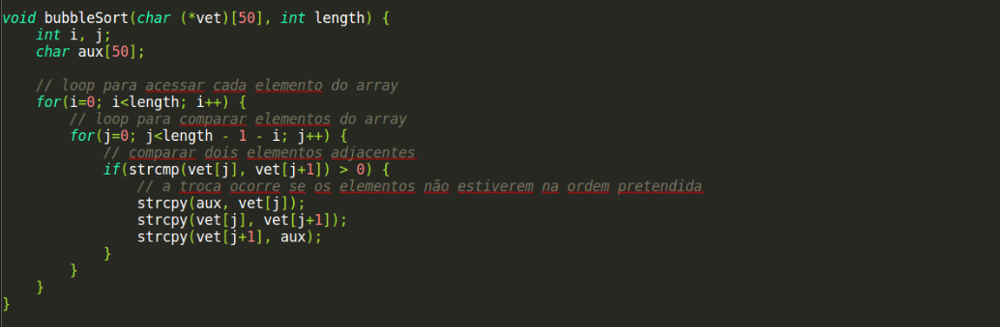
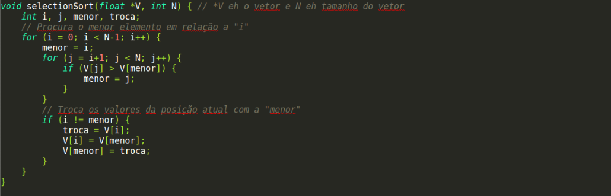

# Tipos de Ordenações em C

Trabalho da Faculdade onde o objetivo é desenvolver 5 métodos de ordenação e explicar passo-a-passo dos mesmos.

- [Bubble Sort](#bubble-sort)
- [Insertion Sort](#insertion-sort)
- [Selection Sort](#selection-sort)
- [Merge Sort](#merge-sort)
- [Heap Sort](#heap-sort)

## Bubble Sort

O algoritmo Bubble Sort percorre todo o vetor diversas vezes e os troca de lugar se estiverem na ordem incorreta

[Codigo completo](bubble_sort.c)

## Insertion Sort

Pega-se um valor de cada vez e o coloca em seu devido lugar, sempre deixando os valores em ordem

[Codigo completo](insertion_sort.c)

## Selection Sort

A cada passo, procura o menor valor do array e o coloca na primeira posição do array

[Codigo completo](selection_sort.c)

## Merge Sort

"Dividir e Conquistar". Esse processo se repete até que exista apenas 1 conjunto

[Codigo completo](merge_sort.c)

## Heap Sort

Vetor que simula uma arvore binária completa (exceção do último nível)

[Codigo completo](heap_sort.c)

